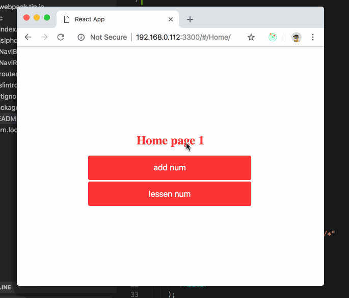

## react-router-pillar

react-router + history + react-spring



## example

```js
import React from 'react';
import {
  Router,
  NaviRoute,
  history,
  hashChange,
} from 'react-router-pillar';

import Home from './Home';
import User from './User';

export default class extends React.PureComponent {
  componentDidMount() {
    history.push('/Home/');
    hashChange();
  }
  render() {
    return (
      <Router history={history}>
        <div>
          <NaviRoute root exact path="/Home/*" component={Home} />
          <NaviRoute exact path="/User/*" component={User} />
        </div>
      </Router>
    );
  }
}
```
